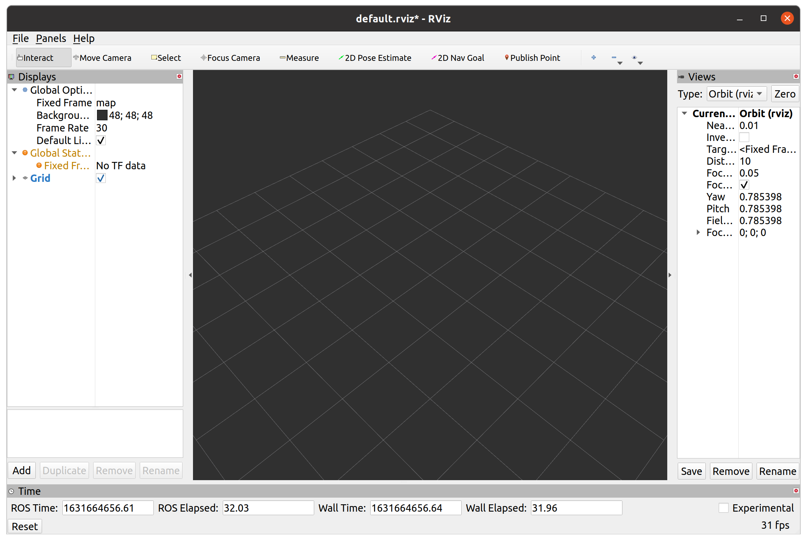

# 設計製作論実習3

## 第1回

千葉工業大学 上田 隆一

<br />

<p style="font-size:50%">
This work is licensed under a <a rel="license" href="http://creativecommons.org/licenses/by-sa/4.0/">Creative Commons Attribution-ShareAlike 4.0 International License</a>.
<a rel="license" href="http://creativecommons.org/licenses/by-sa/4.0/">
</a>
</p>

---

## 今日やること

* （万が一見ていない人がいたら）イントロダクションのビデオを視聴
  * ここに該当する人はハンド作成コースも検討を<br />　
* ビデオを見た人は以下をセットアップ
  * Linux環境（これは独力で準備）
  * ROS（このビデオの内容）
  * マニピュレータのシミュレータ（このビデオの内容）<br />　
* Slack、Backlogへの参加
  * これはmanaba$\rightarrow$Slackで指示済み

---

## ROSのセットアップ

* 前提: Ubuntu 20.04 LTS or 18.04 LTSのデスクトップ版がネイティブ環境で準備されていること
  * 準備がまだの人はセットアップから<br />　
* ROSについてはロボットシステム学のビデオで解説しています
  * https://www.youtube.com/watch?v=PL85Pw_zQH0
  * SlackにもURLを貼り付けますね

---

### ROSのインストール

* GitHub上のインストールスクリプトを利用
    * https://github.com/ryuichiueda/ros_setup_scripts_Ubuntu18.04_desktop
    * https://github.com/ryuichiueda/ros_setup_scripts_Ubuntu20.04_desktop

```
### 18.04の場合（20.04なら18を20に書き換え） ###
$ git clone https://github.com/ryuichiueda/ros_setup_scripts_Ubuntu18.04_desktop.git
$ cd ros_setup_scripts_Ubuntu18.04_desktop/
$ sudo apt update
$ sudo apt upgrade
$ ./locale.ja.bash
$ ./step0.bash
$ ./step1.bash
```

---

### 動作確認

```
$ source ~/.bashrc
$ roscore
... logging to /home/ueda/.ros/log/d26a0c78-b52f-11e9-a961-001c4252779e/roslaunch-1C7F-429.log
Checking log directory for disk usage. This may take awhile.
Press Ctrl-C to interrupt
Done checking log file disk usage. Usage is <1GB.

started roslaunch server http://localhost:49975/
ros_comm version 1.14.3


SUMMARY
========

PARAMETERS
 * /rosdistro: melodic
 * /rosversion: 1.14.3

NODES

auto-starting new master
process[master]: started with pid [439]
ROS_MASTER_URI=http://localhost:11311/

setting /run_id to d26a0c78-b52f-11e9-a961-001c4252779e
process[rosout-1]: started with pid [450]
started core service [/rosout]
```

* プログラムの終了は`Ctrl+C`で

---

### ワークスペースの作成

* ワークスペース: プログラム置き場です
```
$ cd
$ mkdir -p catkin_ws/src
$ cd catkin_ws/src
$ catkin_init_workspace
Creating symlink "/home/ueda/catkin_ws/...
$ cd ..
$ catkin_make
```

* 次いで`~/.bashrc`を編集
```
$ vi ~/.bashrc
・・・
source /opt/ros/melodic/setup.bash
source ~/catkin_ws/devel/setup.bash       #この行を追加
export ROS_MASTER_URI=http://localhost:11311
export ROS_HOSTNAME=localhost
・・・
$ source ~/.bashrc
$ cd ~/catkin_ws/
$ catkin_make
```

---

### CRANE-X7のROSパッケージを<br />インストール

```
$ cd ~/catkin_ws/src
$ git clone https://github.com/rt-net/crane_x7_ros.git
$ git clone https://github.com/rt-net/crane_x7_description.git
$ git clone https://github.com/roboticsgroup/roboticsgroup_gazebo_plugins.git
$ rosdep install -r -y --from-paths --ignore-src crane_x7_ros
・・・
$ ( cd ~/catkin_ws/ && catkin_make )
```


### RVizの動作確認

```
$ source ~/.bashrc
$ roscore &
（しばらく待つ）
$ rviz
```

* 次のページのような画面が出現

---



---

### Gazeboの動作確認

* `~/.ignition/fuel/config.yaml`を編集
```
servers:
  -
    name: osrf
    url: https://api.ignitionrobotics.org #ignitionroboticsに
```
* CRANE-X7のサンプルを立ち上げる
```
$ roslaunch crane_x7_gazebo crane_x7_with_table.launch
```

* 次のページのような画面が出現

---


以上で作業は終了です。
